  

  <h1>
    
  </h1>

  
  
  

  

---

### 🚀 About Me

I'm a developer with a deep passion for problem-solving and building efficient solutions. My primary tool is **Python**, and I spend my time honing my skills in **Competitive Programming** and contributing to the **Open Source** community. I love turning complex problems into clean, elegant code and I'm always looking for a new challenge.

- 🔭 I’m currently building **DevTools Pro**, a tool for helping Devs and Competitive Programmers, and maintaining **My-Portfolio** and **The-Forge**.
- 🌱 I’m currently mastering **advanced algorithms and data structures in Python and C++**.
- 👯 I’m looking to collaborate on **Python-based open source projects**, especially those involving algorithms or data processing.
- 💬 Ask me about **Python, Data Structures, Algorithms, and Git workflows**.

---

### 🛠️ Tech Stack

  

---

### 🏆 Featured Projects

| Project | Description | Tech Stack |
| :--- | :--- | :--- |
| **🚀 [NEW PROJECT NAME]** | [Write a brief description of what your new project does here] |   |
| **⚙️ DevTools Pro** | A tool to assist Developers and Competitive Programmers (Currently in development). |     |
| **🨠The-Forge** | A comprehensive design system I am currently architecting. |    |
| **🌠My-Portfolio** | My personal corner of the internet to showcase my work and skills. |    |

### 📊 My GitHub Stats & Activity

  
  

---

### 🎃 Hacktoberfest Participation

  I'm a proud Super Contributor in Hacktoberfest and a passionate open-source contributor.

  
    
  
  

---

### 📅 My Contribution Calendar

  

---

### 🌐 Connect with Me

  
  &nbsp;&nbsp;
  
  &nbsp;&nbsp;
  

